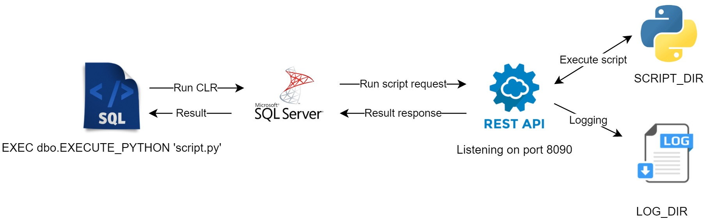

# Summary
The solutions allow users to run python scripts from SQL code, for example:

`EXEC dbo.EXECUTE_PYTHON 'script.py';`

The solution is CLR written for Microsoft SQL Server, but the idea could be used for other SQL engines.

# Schema


# Prerequisites
- REST API Server:
  - Operational system: Linux (preferred), but also works on Windows or MacOS.
  - Python3 + packages in `requirements.txt`.
  - *SCRIPT_DIR* – directory with python scripts to execute.
  - *LOG_DIR* – directory for log storage of API Server.
- SQL Server:
  - Administrator access.


# Installation
## REST API Server
- Copy `/server/` folder to your server.
- Modify `executorApiServer.py`.
  - Change  - *SCRIPT_DIR* and *LOG_DIR*.
  - Windows only:	Replace `cmd += " > /dev/null 2>&1 &"` with `cmd = "cmd.exe /c start " + cmd`.
- Copy `testScript.py` to *SCRIPT_DIR*.
- Execute `test_executorApiServer.py` to validate that API Server is ready for launch.
-	Execute `executorApiServer.py`
## SQL Server preparation
- Open project in IDE (JetBrains Rider or Microsoft Visual Studio recommended).
- Modify `SQLExternalFunctions.cs`, replace localhost with URL of REST API Server.
- Execute `TestSQLExternalFunctions.cs` to validate setup.
- Build project `SQLExternalFunctions`, the following artifact shall be created:
  - `SQLExternalFunctions.dll` – library to call REST API.
  - `Newtonsoft.Json.dll` and `RestSharp.dll` – external dependency of the project.
 - Copy all 3 files from the artifact to the server, for example to `D:\MSSQL\Libs\`.
## SQL Server and CLR
### Prepare database:
```
USE DBNAME;
GO
ALTER DATABASE DBNAME SET TRUSTWORTHY ON;
CREATE ASSEMBLY [System.Runtime.Serialization] FROM 'C:\Windows\Microsoft.NET\Framework64\v4.0.30319\System.Runtime.Serialization.dll' WITH PERMISSION_SET = UNSAFE;
CREATE ASSEMBLY [System.Net.Http] FROM 'C:\Windows\Microsoft.NET\Framework64\v4.0.30319\System.Net.Http.dll' WITH PERMISSION_SET = UNSAFE;
CREATE ASSEMBLY [System.Web] FROM 'C:\Windows\Microsoft.NET\Framework64\v4.0.30319\System.Web.dll' WITH PERMISSION_SET = UNSAFE;
GO
```
### Install CLR:
```
USE DBNAME;
GO
CREATE ASSEMBLY SQLExternalFunctions FROM 'D:\MSSQL\Libs\SQLExternalFunctions.dll' WITH PERMISSION_SET = UNSAFE;
GO
CREATE PROCEDURE dbo.EXECUTE_PYTHON(@script_name NVARCHAR(256), @waitFlag BIT = 1, @parameters NVARCHAR(256) = NULL)
    AS
EXTERNAL NAME SQLExternalFunctions.SQLExternalFunctions.ExecutePython;
GO
```
###  Grant access to users (optional)
```
GRANT EXECUTE ON OBJECT::dbo.EXECUTE_PYTHON TO login1, login2;
```
### Test
```
EXEC Core.dbo.EXECUTE_PYTHON 'testScript.py';
```
## Final notes
- Consider the following security aspects before going on production :
  - `SET TRUSTWORTHY ON` is not the best practice for SQL Server, consider better alternatives.
  - Authentication - implement your own token solution before going to production.
  - Authorization – follow the minimum privilege rule, do not allow users to run all scripts by default.
